#  FX Code Generator 

## Descripción

Implementar una aplicación con GUI empleando el framework JavaFX que permita la definición de beans FX, así como generar el código fuente que los implemente.

Se deberá aplicar el **patrón de diseño MVC** y las **vistas deberán implementarse en FXML**. 

Así mismo, será posible guardar/abrir el modelo de beans FX en/desde un fichero XML con extensión `.fx`.

La aplicación contará también con una opción para generar el código fuente Java de los beans definidos mediante la aplicación.

## Modelo de datos

El modelo de datos que deberá gestionar la aplicación será el siguiente:

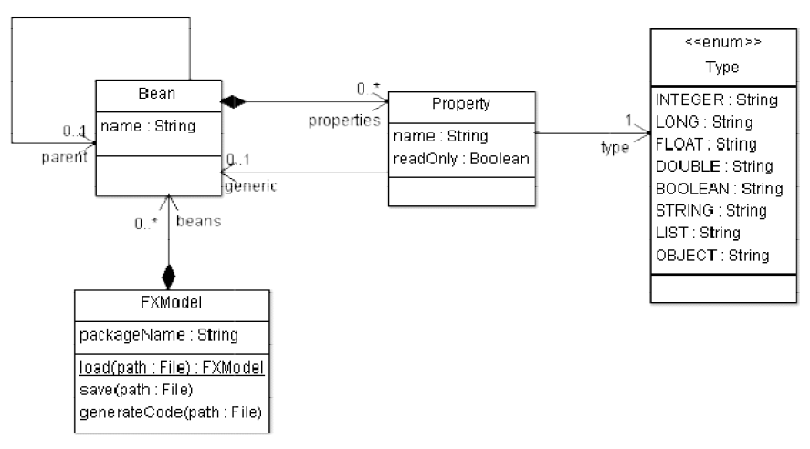

Las clases del modelo de datos se encuentran en el paquete `dad.codegen.model.javafx`.

> **IMPORTANTE**: ¡Las clases del paquete `dad.codegen.model.java` son necesarias para para generar el código Java de los beans, así que no las elimines!

El significado de cada clase es el siguiente:

- **FXModel**: Elemento raíz del modelo. Se utiliza como contenedor de beans, para guardar y cargar el modelo
	desde ficheros XML y para generar el código.
	- **packageName**: Nombre completo del paquete donde se generará el código (ej.: “dad.agenda.beans”)
	- **beans [0..\*]**: Listado de beans disponibles en el modelo.
	- **load(path : File)**: FXModel: método estático que lee un modelo FX desde fichero y lo devuelve.
	- **save(path : File)**: método que guarda el modelo FX en el fichero especificado.
	- **generateCode(path : File)**: método que genera el código fuente Java correspondiente al modelo FX en el directorio indicado (“path” es un directorio en este caso, no un fichero). Se generará un fichero “.java” por cada bean.
- **Bean**: Bean FX con sus propiedades.
	- **name**: Nombre del bean.
	- **parent [0..1]**: Bean padre.
	- **properties [0..\*]**: Propiedades del bean.
- **Property**: Propiedad de un bean.
	- **name**: Nombre de la propiedad.
	- **readOnly**: Indica si la propiedad es de sólo lectura.
	- **type [1..1]**: Tipo de datos de la propiedad (enumerado).
	- **generic [0..1]**: Bean que se usará como genérico si el tipo de datos establecido (type) soporta
		genéricos (Object, List y Set).
- **Type**: Tipo de datos de las propiedades.
	- Enumerado con los tipos de datos soportados por FX Code Generator.

### Ejemplo de uso del modelo de datos

El siguiente código crea un modelo FX con el bean “Persona” que tiene 3 propiedades:

```java
// crea la propiedad "nombre" de tipo String
Property nombre = new Property();
nombre.setName("nombre");
nombre.setType(Type.STRING);

// crea la propiedad apellidos de tipo String
Property apellidos = new Property();
apellidos.setName("apellidos");
apellidos.setType(Type.STRING);

// crea la propiedad fechaNacimiento de tipo Date
Property fechaNacimiento = new Property();
fechaNacimiento.setName("fechaNacimiento");
fechaNacimiento.setType(Type.DATE);

// crea el bean "Persona" y le añade las 3 propiedades
Bean persona = new Bean();
persona.setName("Persona");
persona.getProperties().addAll(nombre, apellidos, fechaNacimiento);

// crea el modelo y le añade el bean "Persona"
FXModel model = new FXModel();
model.setPackageName("dad.agenda.model");
model.getBeans().add(persona);

// genera el código fuente Java en el directorio "gen"
model.generateCode(new File("gen"));
```

La última línea genera el siguiente código Java dentro del directorio `gen` a partir del modelo FX en el paquete indicado en el mismo:

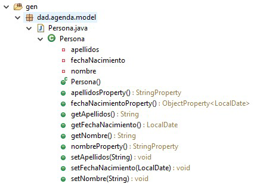

```java
package dad.agenda.model;

import java.time.LocalDate;
import javafx.beans.property.ObjectProperty;
import javafx.beans.property.SimpleObjectProperty;
import javafx.beans.property.SimpleStringProperty;
import javafx.beans.property.StringProperty;

public class Persona {
    private StringProperty nombre;
    private StringProperty apellidos;
    private ObjectProperty<LocalDate> fechaNacimiento;

    public Persona() {
        nombre = new SimpleStringProperty(this, "nombre");
        apellidos = new SimpleStringProperty(this, "apellidos");
        fechaNacimiento = new SimpleObjectProperty<>(this, "fechaNacimiento");
    }

    public String getNombre() {
        return this.nombreProperty().get();
    }

    public void setNombre(final String nombre) {
        this.nombreProperty().set(nombre);
    }

    public StringProperty nombreProperty() {
        return this.nombre;
    }

    public String getApellidos() {
        return this.apellidosProperty().get();
    }

    public void setApellidos(final String apellidos) {
        this.apellidosProperty().set(apellidos);
    }

    public StringProperty apellidosProperty() {
        return this.apellidos;
    }

    public LocalDate getFechaNacimiento() {
        return this.fechaNacimientoProperty().get();
    }

    public void setFechaNacimiento(final LocalDate fechaNacimiento) {
        this.fechaNacimientoProperty().set(fechaNacimiento);
    }

    public ObjectProperty<LocalDate> fechaNacimientoProperty() {
        return this.fechaNacimiento;
    }

}
```

## Interfaz de la aplicación

Al iniciar la aplicación se deberá abrir la “Ventana principal”, que deberá tener el siguiente aspecto:

### Ventana principal

En la lista de la izquierda se listan los beans del modelo.

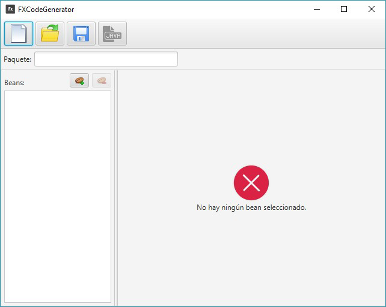

La ventana tendrá una barra de herramientas con los siguientes botones:


A continuación se explica lo que hace cada botón:

#### Nuevo modelo

Se creará un modelo nuevo.

Se deberá pedir confirmación antes de crear el modelo nuevo con un diálogo como el siguiente:

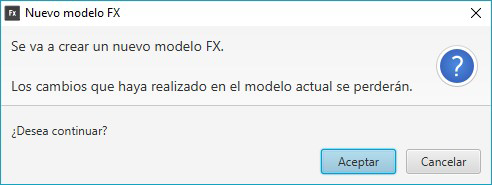

Recuerda desvincular el modelo viejo antes de vincular el nuevo (unbind-bind).

#### Abrir modelo

Se abrirá un modelo FX desde fichero.

Como puede haber pérdida de datos al sobrescribir el modelo FX existente, se pedirá confirmación
antes de abrir el modelo nuevo:

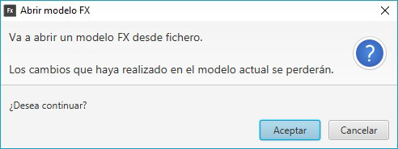

-   Si se **acepta** en el diálogo anterior, se abrirá un `FileChooser` para elegir el fichero a abrir:

    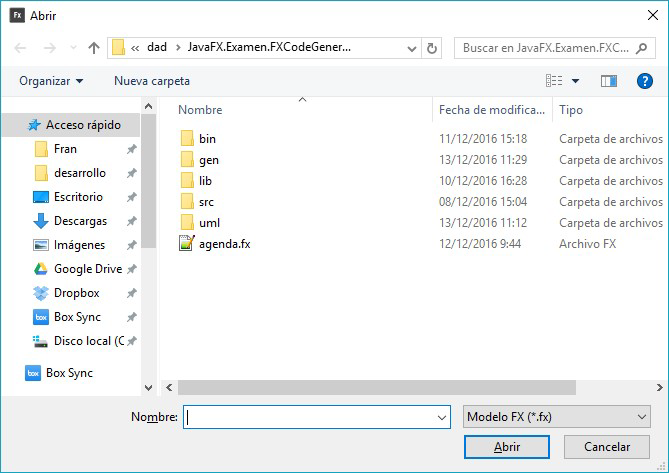


El `FileChooser` se deberá configurar de la siguiente forma:

-   Deberá tener dos filtros (ExtensionFilter):

    -   *Modelo FX (`*.fx`)*
    -   *Todos los archivos (`*.*`)*

-   El directorio inicial por defecto será el directorio `.`: 

    ```java
    new File(“.”)
    ```


-   Deberá tener el icono de la aplicación.

Recuerda desvincular el modelo viejo antes de vincular el que acabas de abrir.

Para abrir el modelo disponemos del método estático “FXModel.load(File fichero)”.

En caso de error, se mostrará el siguiente mensaje, donde (p.ej.) “agenda.fx” podría ser el nombre del
fichero que se ha intentado abrir para cargar el modelo:


#### Guardar modelo

Se guardará el modelo FX actual en un fichero.

Se abrirá un `FileChooser` para elegir el fichero a guardar:

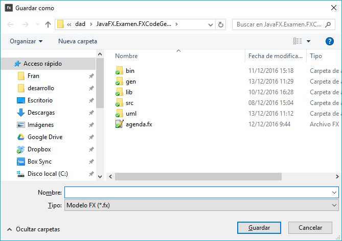

El `FileChooser` se deberá configurar de la siguiente forma:

-   Deberá tener dos filtros (ExtensionFilter):

    -   *Modelo FX (`*.fx`)*
    -   *Todos los archivos (`*.*`)*

-   El directorio inicial por defecto (initialDirectory) será el directorio “.”

    ```java
    new File(“.”)
    ```

-   Deberá tener el icono de la aplicación.

Para guardar el modelo disponemos del método `save(File fichero)` del modelo FX.

En caso de error, se mostrará el siguiente mensaje, donde (p.ej.) `agenda.fx` podría ser el nombre del fichero donde se ha intentado guardar el modelo:

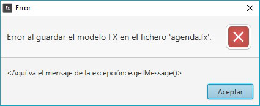

#### Generar código Java

Se generará el código fuente Java de cada uno de los beans del modelo actual en el directorio
especificado.

El directorio se especificará usando un “DirectoryChooser” (similar a “FileChooser”):

```java
DirectoryChooser dirChooser = new DirectoryChooser();
File directorio = dirChooser.showDialog(primaryStage);
if (directorio != null) {
    // TODO aquí ponemos el código para generar el código Java de los beans
}
```

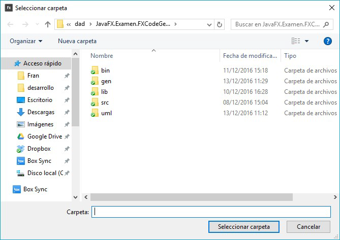

Para generar el código fuente de los beans del modelo FX en el directorio especificado debemos usar
el método `generateCode(File directorio)` del modelo.

Si se genera el código con éxito se mostrará un mensaje como el siguiente:

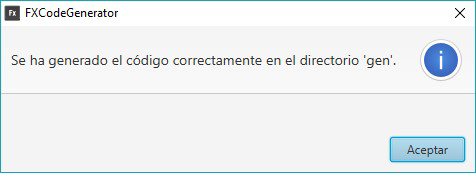

En caso de error, se mostrará el siguiente mensaje, donde (p.ej.) `gen` es el nombre del directorio
donde se ha intentado generar el código:

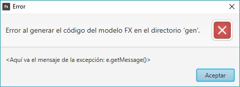


##### Panel para el nombre del paquete del modelo FX (packageName)

Debajo de la barra de herramientas se mostrará el siguiente panel que permitirá especificar el nombre del paquete del modelo FX:

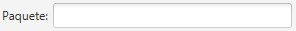

Es el paquete donde se generará el código fuente de los paquetes, y se corresponde con la propiedad `packageName` del modelo FX (**FXModel**). Por ejemplo:

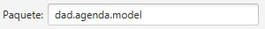

##### Panel de gestión de beans

En la ventana principal se mostrará en el centro un panel (SplitPane) que permitirá gestionar los beans del modelo FX.

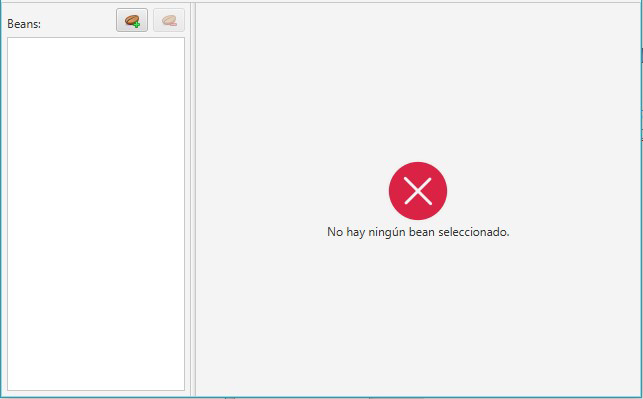

Éste contiene a su vez dos paneles:


###### Panel de la izquierda (panel con el listado de beans)

Éste panel contiene:

**Lista de beans**

Aquí se mostrarán todos los beans que hay en el modelo FX actual.

Si nuestro modelo tuviera los beans `Persona`, `Telefono` e `Identificable`, veríamos lo siguiente:

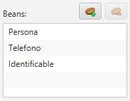

Sólo se podrá seleccionar un elemento de la lista, y ésta NO es editable.

Al seleccionar un bean de la lista cambiará el panel de la derecha por el panel de edición de beans:

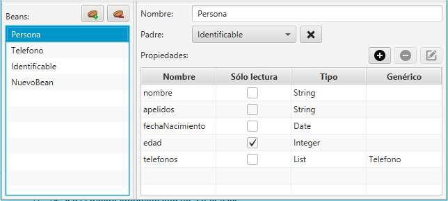

Cuando no haya ningún bean seleccionado se volverá a mostrar en la derecha el panel que indica que no hay seleccionados:

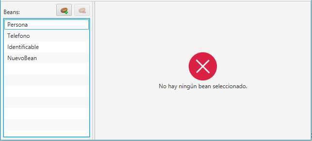

**Añadir bean ** 

Se añadirá un bean nuevo al modelo FX con el nombre (name): `NuevoBean`.

Se seleccionará automáticamente en la lista:

```java
beansList.getSelectionModel().select(nuevoBean)
```

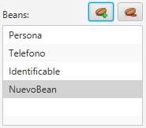

**Eliminar bean **

El botón se habilita sólo cuando hay un elemento seleccionado en la lista de beans.

Se eliminará el bean seleccionado.

Se deberá pedir confirmación antes de eliminarlo, mostrando un diálogo como el siguiente:


###### Panel de la derecha (panel de edición de beans)

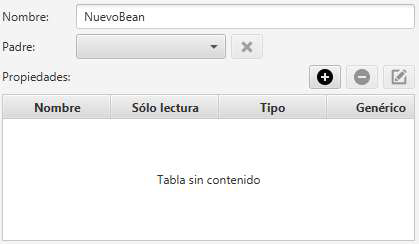

**Área de datos del bean**

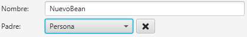

Aquí especificamos el nombre (`name`) y el padre (`parent`) del bean.

El **Nombre** del bean se utilizará para dar nombre a la clase Java generada.

El combo **Padre** permite establecer el bean que se va a extender (opcional; puede ser nulo).

-   Se deberán vincular (bindear) los “ítems” de este combo con la lista de beans del modelo FX,
    de forma que si se añaden nuevos beans estén automáticamente disponibles desde el mismo.

El botón  quita al padre (establece el padre del bean a nulo).

-   El padre de un bean es el bean del que se extiende (`extends`).

-   Se habilita sólo si hay un padre seleccionado:

    

    

**Tabla de propiedades del bean**

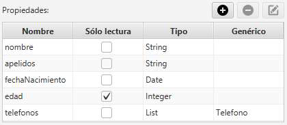

Aquí se gestionan las propiedades del bean (`properties`). La tabla NO es editable y la columna **Sólo lectura** se mostrará con un `CheckBox`:

```java
readOnlyColumn.setCellFactory(CheckBoxTableCell.forTableColumn(readOnlyColumn))
```

-   **Añadir propiedad :** 

    Añade una propiedad nueva a la lista de propiedades del bean que estamos editando.

    La propiedad tendrá por defecto los siguientes valores:

    | name               | type          | readOnly | Generic |
    | ------------------ | ------------- | -------- | ------- |
    | `"nuevaPropiedad"` | `Type.String` | `false`  | `null`  |

    Una vez añadida la propiedad a la lista de propiedades del bean, se seleccionará
    automáticamente el bean en la tabla:

    ```java
    propiedadesTable.getSelectionModel().select(nuevaPropiedad))
    ```

    y se ejecutará la misma acción que el botón **Editar propiedad** (ver más adelante).

    

    Por lo que añadir una nueva propiedad implica añadir una nueva con valores por defecto, seleccionarla en la tabla y editarla **en una sola acción**.

-   **Eliminar propiedad :** 

    Elimina la propiedad seleccionada de la tabla de propiedades.

    Si no hay una propiedad seleccionada, el botón se mostrará deshabilitado.

    Las propiedades se eliminarán de una en una.

    Se deberá pedir confirmación antes de eliminar la propiedad, mostrando un diálogo como el siguiente:

    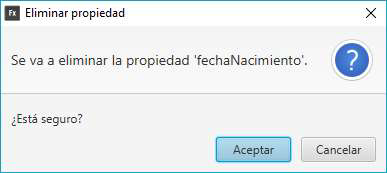

-   **Editar propiedad :** 

    Permite modificar los valores de la propiedad seleccionada en la tabla de propiedades.

    Si no hay una propiedad seleccionada, el botón se mostrará deshabilitado.

    Se abrirá una ventana (`Stage`) como la siguiente:

    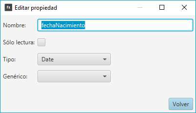

    Desde aquí se podrán modificar todos los valores de una propiedad.

    El combo **Tipo** contendrá la lista de todos los tipos de datos disponibles en el modelo FX:

    -   El método estático `values()` de un enumerado devuelve siempre una lista con todos los posibles valores del mismo:

        ```java
        Type.values() : Type[]
        ```

    En el combo **Genérico** se presentará la lista de todos los beans.

    -   Se deberá vincular (bindear) los “ítems” de este combo con la lista de beans del modelo FX, de forma que si se añaden nuevos beans, estén automáticamente disponibles en este combo.

## Criterios de calificación

| Criterio                                                     | Puntuación |
| ------------------------------------------------------------ | ---------- |
| Ventana principal > Diseño                                   | 5          |
| Botones de la barra de herramientas > Nuevo modelo           | 5          |
| Botones de la barra de herramientas > Abrir modelo           | 5          |
| Botones de la barra de herramientas > Guardar modelo         | 5          |
| Botones de la barra de herramientas > Generar modelo         | 5          |
| Panel nombre paquete > Diseño + Vinculación modelo           | 5          |
| Lista de beans > Diseño + Vinculación modelo                 | 6          |
| Lista de beans > Añadir bean                                 | 4          |
| Lista de beans > Eliminar bean                               | 4          |
| Lista de beans >  Seleccionar/Deseleccionar bean (cambio de panel derecho) | 6          |
| Panel informativo NO bean seleccionado > Diseño              | 5          |
| Panel edición bean > Diseño                                  | 8          |
| Panel edición bean > Área de datos del bean: Diseño + Vinculación + Quitar padre | 7          |
| Panel edición bean > Tabla propiedades bean: Diseño + Vinculación modelo | 7          |
| Panel edición bean > Añadir propiedad                        | 5          |
| Panel edición bean > Eliminar propiedad                      | 4          |
| Panel edición bean > Editar propiedad                        | 14         |
| **TOTAL**                                                    | **100**    |

>   **IMPORTANTE:** El profesor determinará el grado de cumplimiento de cada apartado a partir de la ejecución de la aplicación, por lo que es sumamente importante que los apartados que queremos que puntúen se puedan probar.